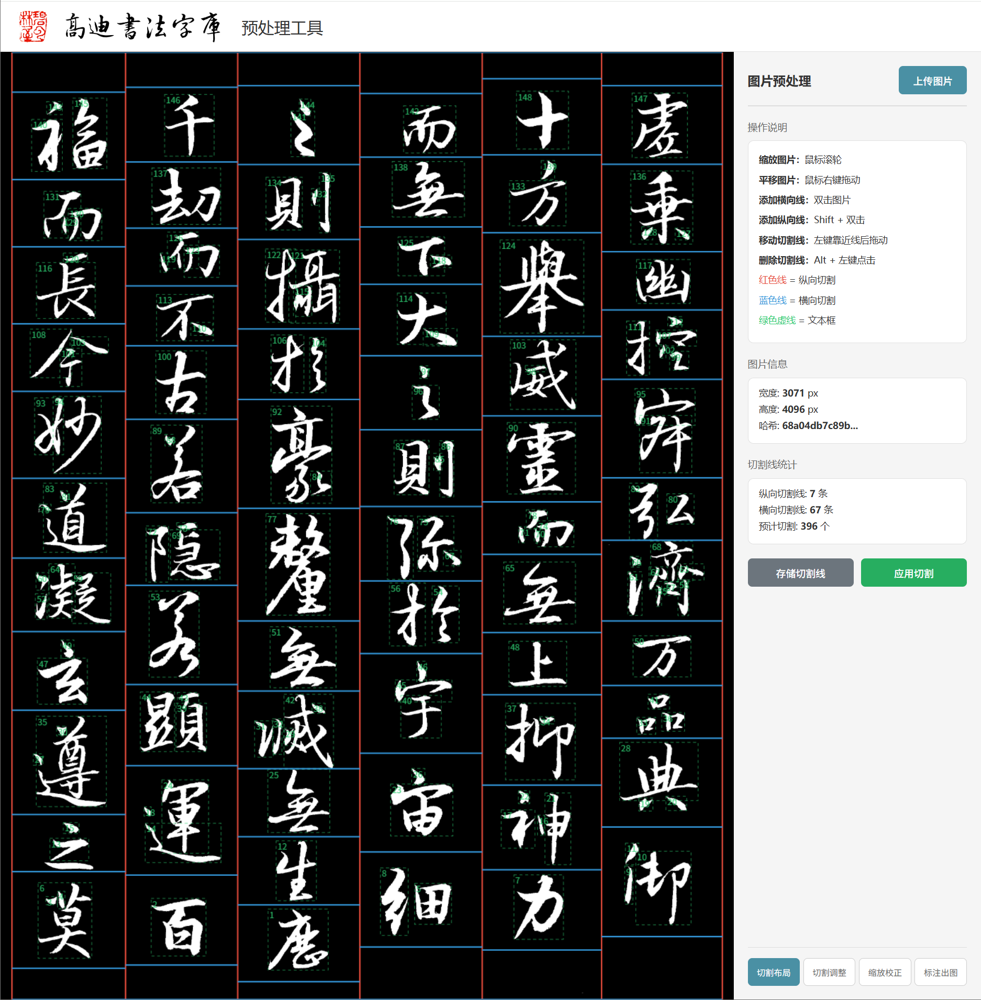
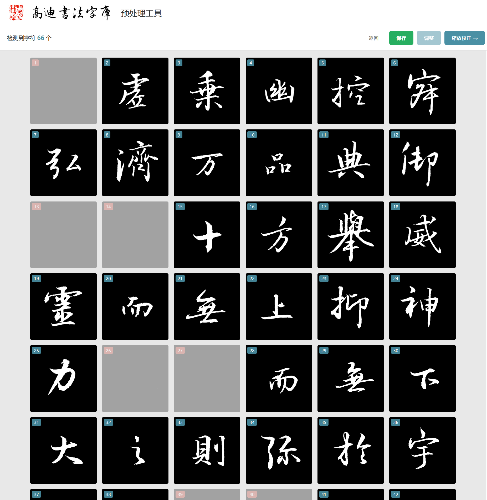
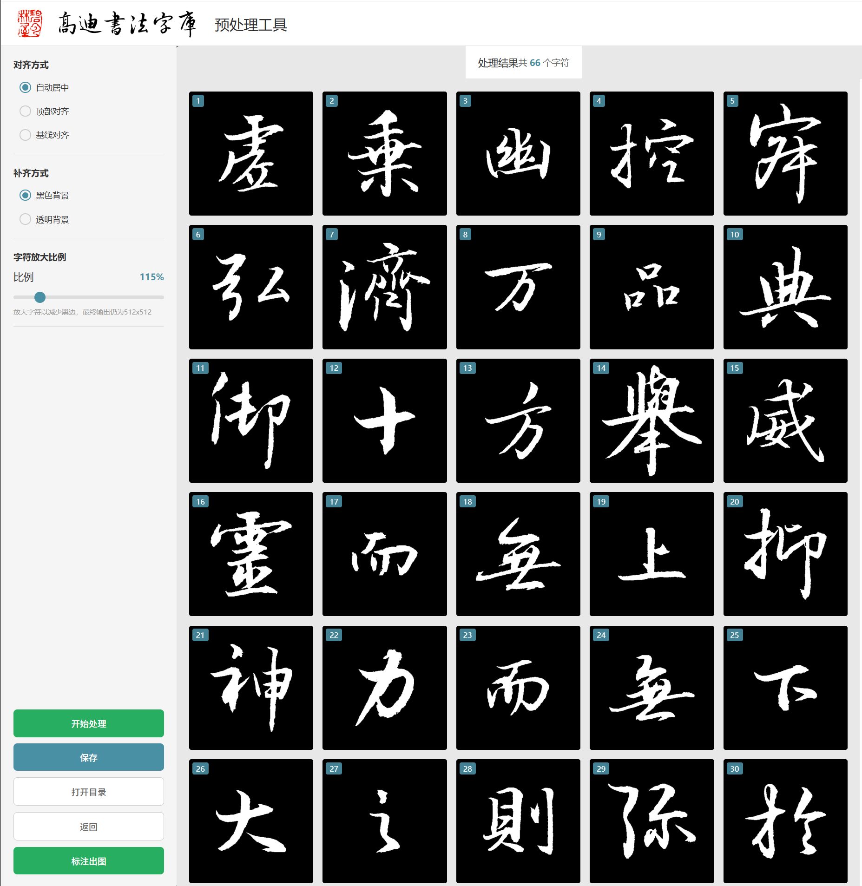
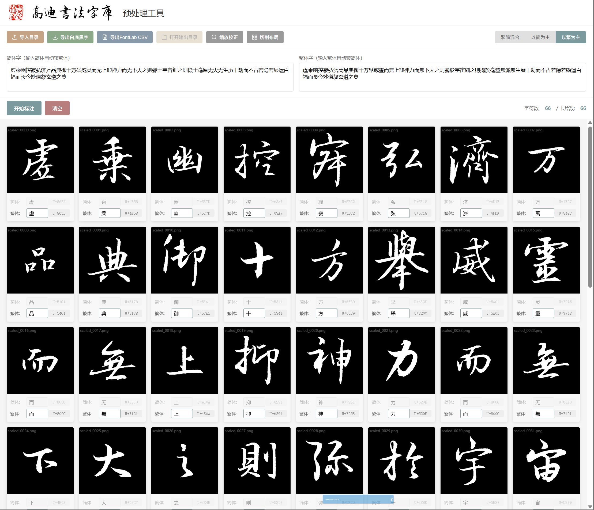
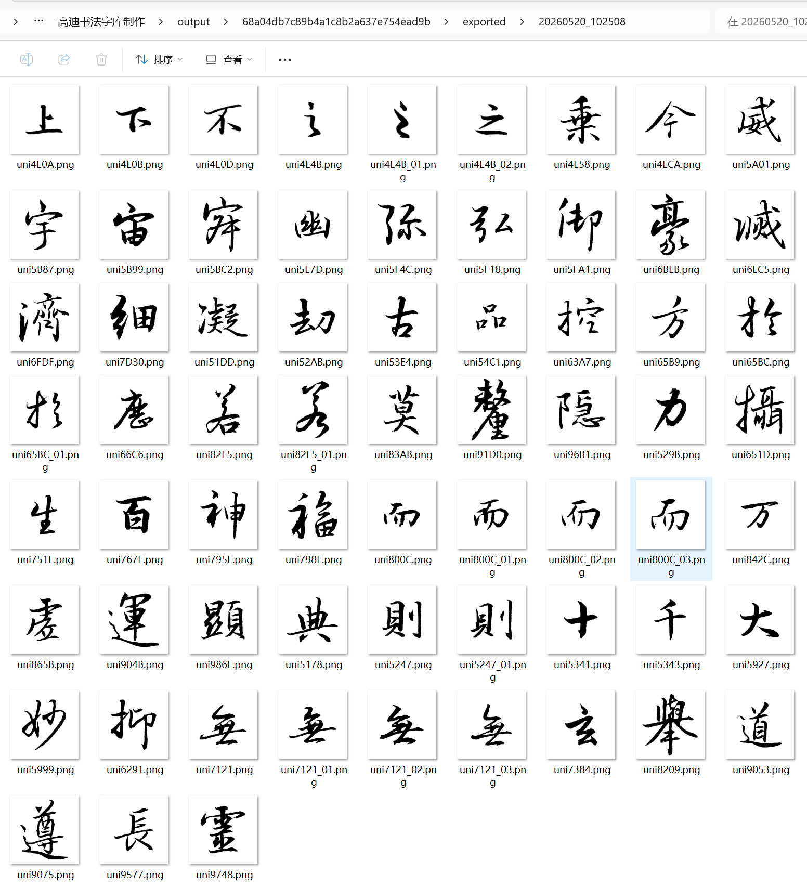

# 高迪书法字库预处理工具

为书法爱好者制作手写字库的预处理软件。将手写书法作品图片切割、校正、标注，输出 FontLab 标准命名的字符图片。

## 功能特性

| 步骤 | 功能 | 说明 |
|------|------|------|
| 1. 切割布局 | 自动检测 + 手动调整 | 解决书法作品行列间距不均问题 |
| 2. 切割调整 | 逐字检查 | 删除噪点、错字、空白 |
| 3. 缩放校正 | 统一像素、居中排版 | 生成标准尺寸单字图 |
| 4. 标注出图 | 批量/手动标注、繁简转换 | 支持繁简混合模式、CJK 扩展区字符 |
| 5. 导出命名 | FontLab 标准命名 | BMP 字符 `uniXXXX`，扩展区字符 `uXXXXX` |

## 快速开始

### 方式一：独立运行版（推荐）

从 [GitHub Release](https://github.com/gaudi1209/gaudi-font-preprocess/releases) 下载最新的 `高迪书法字库预处理工具.zip`，解压后双击 `启动.bat` 即可使用，无需安装 Python 及任何依赖。

### 方式二：从源码运行

```bash
# 克隆仓库
git clone https://github.com/gaudi1209/gaudi-font-preprocess.git
cd gaudi-font-preprocess

# 安装依赖
pip install -r requirements.txt

# 启动
python app.py
```

启动后浏览器自动打开 `http://localhost:5000`。

## 使用说明

### 步骤 1：切割布局



- 上传手机拍摄的书法图片
- 软件自动检测行列切割线
- 可手动拖动切割线调整位置，Shift+双击添加新切割线

### 步骤 2：切割调整



- 逐字检查切割结果
- 删除噪点、错字、空白切片

### 步骤 3：缩放校正



- 统一字符像素尺寸
- 自动居中排版

### 步骤 4：标注出图



- 三种标注模式：繁简混合、以简为主、以繁为主
- 支持批量标注和手动逐字标注
- 自动 OCR 识别辅助标注
- 导出后自动清理中间文件

### 步骤 5：导出



- 输出 FontLab 标准命名的字符图片
- 重复字符自动添加后缀区分

## 技术栈

- **后端**：Python + Flask
- **图像处理**：OpenCV + Pillow
- **OCR**：EasyOCR
- **繁简转换**：OpenCC

## 相关项目

- [高迪书法字库 AI 字体工具](https://github.com/gaudi1209/ai-font-tool) - 基于 zi2zi 的 AI 字体生成工具

## 许可

MIT License
